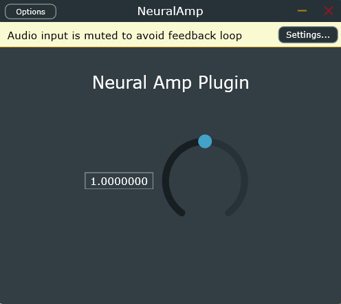

# 🎸 Neural Amp

An AI-powered Guitar Amplifier plugin (VST3 / Standalone) built with C++, the JUCE Framework, and RTNeural. This project clones the sound of a real guitar amplifier using Deep Learning models trained in Python.



## ✨ Features
* **AI Amp Cloning:** Uses Neural Networks (LSTM + Dense) to recreate the non-linear distortion of real guitar amplifiers.
* **Low Latency:** Optimized for real-time audio processing using the `RTNeural` inferencing engine.
* **Formats:** Available as a Standalone application and a VST3 plugin for DAWs (Reaper, Cubase, Ableton, etc.).
* **Train Your Own:** Includes Python scripts to train your own models using direct-in (DI) and processed guitar signals.

## 🏗️ Architecture
```
DI Guitar Signal
      │
      ▼
┌─────────────────────┐
│   Python Training   │
│  ┌───────────────┐  │
│  │  LSTM (×32)   │  │
│  │  Dense (×1)   │  │
│  └───────────────┘  │
│   PyTorch / MSELoss │
└────────┬────────────┘
         │ model_weights.json
         ▼
┌─────────────────────┐
│   C++ VST3 Plugin   │
│  ┌───────────────┐  │
│  │   RTNeural    │  │
│  │  Inference    │  │
│  └───────────────┘  │
│   JUCE Framework    │
└─────────────────────┘
         │
         ▼
  Processed Signal
```

## 🛠️ How to Build from Source

### Prerequisites
* CMake (v3.22 or higher)
* Visual Studio 2022 / 2019 (with Desktop Development with C++)
* Git

### Build Instructions
```bash
git clone https://github.com/YOUR_USERNAME/Neural-Amp.git
cd Neural-Amp/juce_plugin

# Generate the Visual Studio project files
cmake -B build -G "Visual Studio 17 2022" -A x64

# Build the plugin
cmake --build build --config Release
```

*The compiled binaries (`.exe` and `.vst3`) will be located in `juce_plugin/build/NeuralAmp_artefacts/Release/`.*

---

## 🧠 How to Train Your Own Amp Model

1. Install dependencies:
```bash
    pip install torch numpy librosa soundfile pedalboard
```
2. Place your clean guitar track (e.g., `my_guitar.wav`) inside `python_training/`.
3. Run the pipeline:
```bash
    cd python_training
    python main.py
```
4. The script will output:
    - `dataset_dry.wav` — clean signal
    - `dataset_wet.wav` — processed signal
    - `predicted_full_audio.wav` — model's prediction
    - `model_weights.json` — trained model weights
5. Copy `model_weights.json` to `NeuralAmp.vst3/Contents/x86_64-win/` and reload the plugin in your DAW.

## 🧰 Tech Stack
| Layer | Technology |
|-------|-----------|
| Neural Network Training | Python, PyTorch |
| Audio Preprocessing | librosa, pedalboard |
| Plugin Framework | C++, JUCE |
| ML Inference Engine | RTNeural |
| Build System | CMake |